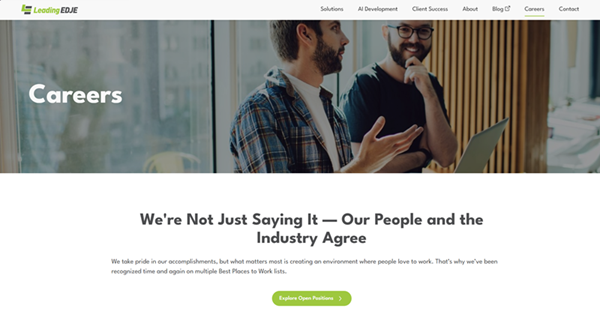

# Leading EDJE Community Workshop

## Who we are

 **Matthew-Hope Eland** - *Sr. Solutions Developer II / Innovation & Excellence Leader (Wizard)*

Matthew-Hope is an AI Specialist and thought leader helping enterprises navigate AI strategy and hands-on integration. Their published work and speaking platform shape how organizations approach AI-assisted development and data-driven decision-making. Beyond thought leadership, Matthew-Hope partners with technical teams on real-world AI adoption, making complex concepts both rigorous and actionable. Matthew-Hope has authored 5 books and training courses and holds 4 Microsoft MVP awards in areas related to software development and AI.

 **Ben Grossman** - *Principal Solutions Engineer / Director, Delivery Success*

Ben is a DevOps Specialist and strategic architect in cloud modernization and DevOps transformation, pioneering how enterprises embed agentic AI into their development lifecycle. He guides organizations through complex platform migrations and delivery pipeline optimization—helping teams move faster without sacrificing security or quality. Ben's focus extends beyond implementation: he coaches technical leadership and engineering teams to own the practices that sustain competitive advantage.

## Setup and Troubleshooting

See [setup.html](setup.html) for installation / getting started instructions.

Clone [https://github.com/LeadingEDJE/AI-Training-Class](https://github.com/LeadingEDJE/AI-Training-Class) for sample prompts and resources.

If you haven't already, start thinking about a real-world project you'd like to try these techniques on in the back half of this workshop as well as recent or upcoming tickets related to it.

Please interrupt us at any point to get assistance or ask additional questions.

## Agenda

- Introduction & Setup
  - [Environment setup](setup.html)
  - Clone [https://github.com/LeadingEDJE/AI-Training-Class](https://github.com/LeadingEDJE/AI-Training-Class)
  - How to get the most out of this workshop

- Demo 1 - Basics
  - What are Agents and what can they do
  - Modes: manual, accept edits, auto, and plan
  - Where to work: main branch, feature branch, worktree, or cloud agent
  - Hello World demo
  - Tools: CLI, GUI, extensions, and APIs

- Project 1 - QR Code Generator (Matt, Claude Code Extension)
  - Creating a small business application
  - Work from pre-provided prompts: minimal, open-ended, or explicit

- Demo 2 - Levelling Up
  - Model selection
  - Advisor mode
  - Planning and subagents
  - Tokens and costs
  - Prompt caching
  - Context windows and new conversations
  
- Project 2 - Small Game
  - Build a simple game using your own tech stack
  - Choose from suggested projects or create your own
  - Practice expanding your idea, fixing bugs, adding features

- Demo 3 - Context and Quality
  - Context engineering
  - CLAUDE.md / AGENTS.md
  - Text search and embeddings
  - Skills, code review skills, and skill generation
  - Model Context Protocol (MCP)

- Project 3 - Maintaining a Brownfield Repository
  - **Bring your own repository** or use the provided open-source project
  - Add context, plan a feature or bug fix, and identify where AI is getting things right or wrong
  - Try different prompts and insights, or build your own skills
  - Look at a recent ticket, have AI try it, and compare the results

- Conclusion and additional learning opportunities

## Feedback and Suggestions

If you have feedback on the workshop, we'd love to hear it. Please [fill out our survey](https://forms.gle/pkdQTkmAdiJJvH8b9) or [email EdjeAiTraining@LeadingEDJE.com](mailto:edjeaitraining@leadingedje.com?subject=Workshop%20Feedback).

## Career Opportunities

Leading EDJE is an awesome place to work and is currently hiring. You can [check out our careers online](https://www.leadingedje.com/careers) or email [Recruiting@LeadingEDJE.com](mailto:Recruiting@LeadingEDJE.com) for more details.

## Additional Resources

If you're interested in learning more about things mentioned in this workshop, we'd recommend the following next steps:

- [Agentic AI Tools & Resources for Senior Developers](https://blog.LeadingEDJE.com/post/agentic-ai-tools-resources.html)
- [Beyond the Code: Why Your AI Tools Aren't Making You Faster (and how to fix it)](https://blog.LeadingEDJE.com/post/why-ai-tools-arent-making-you-faster.html)
- [How Context Impacts AI Agent Output](https://blog.LeadingEDJE.com/post/ensuringaiquality/context.html)
- [Teaching an AI to Build Software: Five Iterations of Spec-Driven Development](https://blog.LeadingEDJE.com/post/fiveiterationsofsdd.html)
- [Shifting Left with Agentic Development (Claude Agent Hooks)](https://blog.LeadingEDJE.com/post/claudeagenthooks.html)
- [AI-Assisted Development topic hub](https://blog.LeadingEDJE.com/topics/ai-assisted-development.html)
- [Effective Context Engineering for AI Agents — Anthropic Engineering](https://www.anthropic.com/engineering/effective-context-engineering-for-ai-agents)
